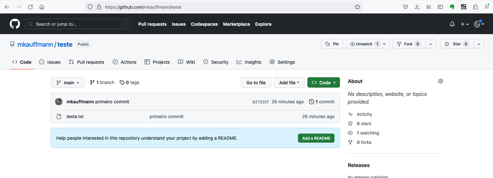

# Roteiro de aula

### Introdução (30min)
Puxar discussão com alunos sobre a importância do controle de versão e métodos que eles usam em outros contextos.
Exemplos: 
-  renomear arquivo de trabalho acadêmico (trabalho_VERSAOFINAL.doc)
-  criar saves diferentes em um videogame
-  compactar e renomear uma pasta de projeto
-  salvar a pasta do projeto em diferentes pen-drives

### Apresentar Git e Github (30min)
- Exposição sobre o que é o Git
- Como surgiu o versionamento no contexto do desenvolvimento de software (exemplos de outros sistemas de versionamento)
- Apresentar o Github e definir o que é um repositório remoto (Exemplo: backup na nuvem dos saves de playstation ou nintendo switch; pasta do google drive com seus documentos de trabalhos acadêmicos)
- Explicar a importância do Github para a colaboração em equipe, assunto que será aprofundado nas próximas aulas


### Instalação e configuração local do Git (30min)
Garantir que todos os alunos já tenham criado uma conta do Github previamente e então compartilhar a tela e fazer a configuração inicial do git localmente junto com os alunos.

-   Baixar e rodar o [instalador](https://git-scm.com/downloads)
-   Configurar `user.name` e `user.email`:
```
git config --global user.name "Fulano de Tal"
git config --global user.email fulanodetal@exemplo.br
```
- Configurar o nome padrão de branch inicial para main e contextualizar a mudança de master para main devido às implicações escravocratas do termo:
```
git config --global init.defaultBranch main
```
- Testar a instalação abindo o terminal em qualquer pasta e digitando `git` 
  
### Criando o primeiro projeto local (15min)
- Criar uma nova pasta
- Navegar pelo terminal para dentro da pasta e rodar o comando `git status` 
- Rodar o comando `git init` 
- Rodar nomavente o comando `git status` e notar a diferença 

### Primeiro commit (15min)
- Nesta mesma pasta, criar um arquivo .txt vazio e rodar o comando `git status`. Notar que o arquivo aparece como não-rastreado pelo git 
- Rodar o comando `git add .` e `git status` explicar o que é a staging area

- Rodar o comando `git commit -m "primeiro commit"` e explicar sobre mensagens de commit

- Rodar o comando `git log` para mostrar o commit feito


### Criando o primeiro repositório remoto (20min)
- Logar no Github e criar um novo repositório público

- Cada aluno vai pegar a url de seu próprio repositório

- Na pasta do projeto, adicionar o repositório remoto com o comando
```
git remote add origin <<URL DO ALUNO>>
```
- Testar executando o comando `git remote`

- Subir o repositório local executando o comando `git push origin main` e recarregar a página do Github para conferir



### Primeiro clone (15min)
- Fornecer um repositório com um projeto simples em HTML e CSS que será usado nas aulas durante a semana e clonar via HTTPS rodando o comando
```
git clone <<URL DO REPOSITORIO>>
```


### Encerramento (20min)
Recapitular o que vimos, explicar o exercício de fixação e abrir espaço para discussão e dúvidas. 